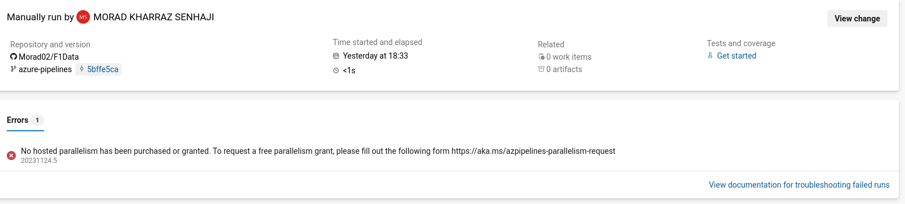

# Criterios de elección de CI tools

- *Servicio gratuito.* Se considerará si el servicio es gratuito o no.
- *Integración con GitHub.* Se evaluará si el servicio se integra con GitHub.
- *Integración con Docker.* Se evaluará si el servicio se integra con Docker
- *Online* Se evaluará si el servicio es online o no. Nos referimos a que no requiera instalación en local.

#  criterios de búsqueda de CI tools

- *Popularidad.* Se evaluará la popularidad de la herramienta.
- *Mantenimiento.* Se evaluará si la herramienta está siendo mantenida.

# Candidatos

## Github Actions

- *Servicio gratuito.* Sí.
- *Integración con GitHub.* Sí.
- *Integración con Docker.* Sí.
- *Online* Sí.

## Travis CI

- *Servicio gratuito.* Sí.
- *Integración con GitHub.* Sí.
- *Integración con Docker.* Sí.
- *Online* Sí. 

## Semaphore CI

- *Servicio gratuito.* No. (Solo una prueba de 14 días)
- *Integración con GitHub.* Sí.
- *Integración con Docker.* Sí.
- *Online* Sí.

## Azure Pipelines

- *Servicio gratuito.* Sí.
- *Integración con GitHub.* Sí.
- *Integración con Docker.* Sí.
- *Online* Sí.

# Pruebas

## Maneras de probar el código

### Docker

Una posible configuración sería configurar una pipeline para que cuando se de la situación necesaria (push de código, tests, dockerfile, etc) se construya la imagen y se ejecute el contenedor. De esta manera se podría probar el código en un entorno controlado. 
Siguiendo con Docker, otra posibilidad sería en lugar de construir la imagen, descargarla de DockerHub y ejecutar el contenedor.

### Deno

Otra posibilidad sería ejecutar los tests con deno. Para ello se ha de instalar deno en el agente de la pipeline y ejecutar los tests.
En este caso hemos de elegir la versión o versiones que queramos testear. 

## Azure pipelines
 
No ha sido posible hacerlo funcionar. El problema es que azure ha cambiado su política de tiers.

Aunque ponga que no dispongamos de paralelismo para la ejecución, las tareas se ejecutan en secuencia, pero una secuencia en azure está documentada como un agente paralelo (creo que podría tener mejor nombre). Hace poco tiempo, azure ha desactivado los agentes paralelos para las nuevas cuentas gratuitas, y si queremos por lo menos un agente paralelo hemos de rellenar este [formulario](https://aka.ms/azpipelines-parallelism-request). Aunque lo he solicitado, no he recibido respuesta.
