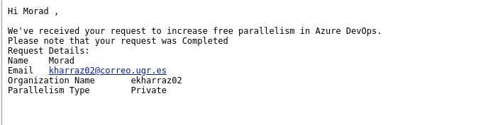

# Criterios de elección de CI tools

- *Servicio gratuito.* Se considerará si el servicio es gratuito o no.
- *Integración con GitHub.* Se evaluará si el servicio se integra con GitHub.
- *Integración con Docker.* Se evaluará si el servicio se integra con Docker
- *Online* Se evaluará si el servicio es online o no. Nos referimos a que no requiera instalación en local.

#  criterios de búsqueda de CI tools

- *Popularidad.* Se evaluará la popularidad de la herramienta.
- *Mantenimiento.* Se evaluará si la herramienta está siendo mantenida.

# Candidatos

| CI Tool                                                                           | Servicio gratuito | Integración con GitHub | Integración con Docker | Online |
|-----------------------------------------------------------------------------------|------------------|-----------------------|-----------------------|--------|
| [Github Actions](https://github.com/features/actions)                             | Sí               | Sí                    | Sí                    | Sí     |
| [Travis CI](https://www.travis-ci.com/)                                           | Sí               | Sí                    | Sí                    | Sí     |
| [Semaphore CI](https://semaphoreci.com/)                                          | 14 días          | Sí                    | Sí                    | Sí     |
| [Azure Pipelines](https://azure.microsoft.com/es-es/products/devops/pipelines/)   | Sí               | Sí                    | Sí                    | Sí     |

# Maneras de probar el código

## Docker

Una posible configuración sería configurar una pipeline para que cuando se de la situación necesaria (push de código, tests, dockerfile, etc) se construya la imagen y se ejecute el contenedor. De esta manera se podría probar el código en un entorno controlado. 
Siguiendo con Docker, otra posibilidad sería en lugar de construir la imagen, descargarla de DockerHub y ejecutar el contenedor.

## Deno

Otra posibilidad sería ejecutar los tests con Deno. Para ello se ha de instalar Deno en el agente de la pipeline y ejecutar los tests.
En este caso hemos de elegir la versión o versiones que queramos testear. 

### Elección de versiones

Vamos a testear dos versiones. En Semaphore, se usará la última versión estable. Al construir la imagen de nuevo, cada vez que se ejecute la pipeline, se descargará la última versión de la imagen base (que tiene la última versión estable de Deno). En GitHub Actions, se usará la versión canary. Las versiones canary son versiones que se actualizan cada pocos días y que contienen las últimas funcionalidades.    

# Pruebas

## Azure pipelines
 
No ha sido posible hacerlo funcionar. El problema es que azure ha cambiado su política de tiers.

Aunque ponga que no dispongamos de paralelismo para la ejecución, las tareas se ejecutan en secuencia, pero una secuencia en azure está documentada como un agente paralelo (creo que podría tener mejor nombre). Hace poco tiempo, azure ha desactivado los agentes paralelos para las nuevas cuentas gratuitas, y si queremos por lo menos un agente paralelo hemos de rellenar este [formulario](https://aka.ms/azpipelines-parallelism-request). Aunque lo he solicitado, no he recibido respuesta.

> Nota: Hemos vuelto a mandar la solicitud y ha sido aceptada. Se ha configurado para que descargue la imagen que está en DockerHub y ejecute el contenedor.

## Github Actions

Se ha configurado siguiendo la documentación ofrecida por Deno para [CI](https://docs.deno.com/runtime/manual/advanced/continuous_integration). En este caso, se ha optado por usar Deno con la versión decidida anteriormente. 

## Semaphore CI

Para mi, ha sido el más fácil de usar. Simplemente se ha usado su interfaz gráfica junto con templates para general el pipeline. Tras la generación, te da la opción de verlo en formato yml. En este caso, se ha optado por usar Docker para ejecutar los tests. El inconveniente es que solo tiene una prueba gratuita de 14 días y un tier limitado.

## Travis CI

Para usarlo, simplemente hay que crear un fichero .travis.yml en la raíz del proyecto. En este caso, tras varios intentos no ha sido posible ponerlo en marcha.

# Elección

La CI tool del proyecto será Github Actions, ya que cumple con todos los requisitos establecidos. Las otras herramientas probadas, podríamos quedarnos con todas pero debido a los diferentes problemas que han surgido, solo ha sido posible hacer funcionar Semaphore CI. Como ya tenemos GitHub actions sin restricciones, podemos dejar Semaphore CI durante el periodo de prueba y luego eliminarlo.

>Nota: aunque no se ha comentado todas las herramientas usan checks app de GitHub. Además, su configuración es muy sencilla y se hace desde la interfaz gráfica de cada herramienta que simplemente hay que darle permisos para que pueda acceder a nuestro repositorio con los permisos necesarios.